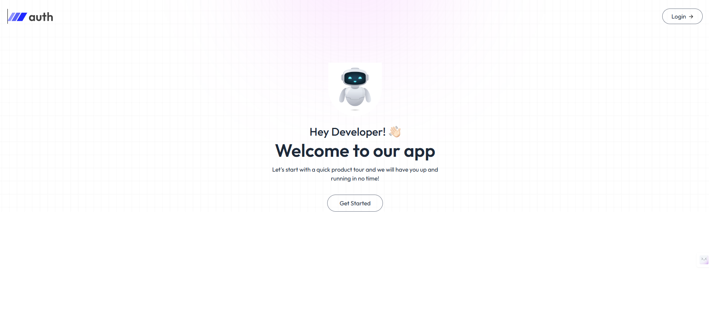

# MERN Authentication System

A full-stack authentication application built with the MERN stack (MongoDB, Express.js, React, Node.js) featuring user registration, email verification, login, and password reset functionality.



## 🚀 Features

- **User Registration** - Sign up with email and password
- **Email Verification** - OTP-based email verification system
- **User Login** - Secure authentication with JWT tokens
- **Password Reset** - OTP-based password recovery via email
- **Protected Routes** - Client-side route protection
- **Responsive UI** - Modern, mobile-friendly interface with TailwindCSS
- **Toast Notifications** - Real-time feedback with React Toastify

## 🛠️ Technologies Used

### Frontend
- **React 19** - UI library
- **Vite** - Build tool and dev server
- **React Router DOM** - Client-side routing
- **Axios** - HTTP client
- **TailwindCSS** - Utility-first CSS framework
- **React Toastify** - Toast notifications

### Backend
- **Node.js** - JavaScript runtime
- **Express.js** - Web framework
- **MongoDB** - Database
- **Mongoose** - ODM for MongoDB
- **JWT** - JSON Web Tokens for authentication
- **bcryptjs** - Password hashing
- **Nodemailer** - Email sending
- **Cookie Parser** - Cookie handling
- **CORS** - Cross-origin resource sharing

## 📁 Project Structure

```
mernAuth/
├── client/                 # Frontend React application
│   ├── src/
│   │   ├── assets/        # Images and static files
│   │   ├── components/    # Reusable components
│   │   │   ├── Header.jsx
│   │   │   └── Navbar.jsx
│   │   ├── context/       # React Context
│   │   │   └── Appcontext.jsx
│   │   ├── pages/         # Page components
│   │   │   ├── Home.jsx
│   │   │   ├── Login.jsx
│   │   │   ├── EmailVerify.jsx
│   │   │   └── ResetPassword.jsx
│   │   ├── App.jsx
│   │   └── main.jsx
│   └── package.json
│
└── server/                # Backend Node.js application
    ├── config/            # Configuration files
    │   ├── mongodb.js
    │   └── nodemailer.js
    ├── controllers/       # Route controllers
    │   ├── authController.js
    │   └── usercontroller.js
    ├── middleware/        # Custom middleware
    │   └── userAuth.js
    ├── models/            # Database models
    │   └── userModel.js
    ├── routes/            # API routes
    │   ├── authroutes.js
    │   └── userroutes.js
    ├── server.js
    └── package.json
```

## 🔧 Installation

### Prerequisites
- Node.js (v14 or higher)
- MongoDB (local or MongoDB Atlas)
- npm or yarn

### Clone Repository
```bash
git clone <your-repository-url>
cd mernAuth
```

### Backend Setup

1. Navigate to server directory:
```bash
cd server
```

2. Install dependencies:
```bash
npm install
```

3. Create a `.env` file in the server directory:
```env
PORT=5000
MONGODB_URI=your_mongodb_connection_string
JWT_SECRET=your_jwt_secret_key
EMAIL_USER=your_email@gmail.com
EMAIL_PASS=your_email_app_password
CLIENT_URL=http://localhost:5173
```

4. Start the server:
```bash
npm start
```

The server will run on `http://localhost:5000`

### Frontend Setup

1. Navigate to client directory:
```bash
cd client
```

2. Install dependencies:
```bash
npm install
```

3. Create a `.env` file in the client directory (if needed):
```env
VITE_BACKEND_URL=http://localhost:5000
```

4. Start the development server:
```bash
npm run dev
```

The client will run on `http://localhost:5173`

## 🔑 Environment Variables

### Server (.env)
| Variable | Description |
|----------|-------------|
| `PORT` | Server port number |
| `MONGODB_URI` | MongoDB connection string |
| `JWT_SECRET` | Secret key for JWT tokens |
| `EMAIL_USER` | Email address for nodemailer |
| `EMAIL_PASS` | Email app password |
| `CLIENT_URL` | Frontend URL for CORS |

### Client (.env)
| Variable | Description |
|----------|-------------|
| `VITE_BACKEND_URL` | Backend API URL |

## 📝 API Endpoints

### Authentication Routes
- `POST /api/auth/register` - Register a new user
- `POST /api/auth/send-verify-otp` - Send verification OTP
- `POST /api/auth/verify-account` - Verify user account
- `POST /api/auth/login` - User login
- `POST /api/auth/logout` - User logout
- `POST /api/auth/send-reset-otp` - Send password reset OTP
- `POST /api/auth/reset-password` - Reset password

### User Routes
- `GET /api/user/data` - Get user data (protected)

## 🚀 Quick Start

Run both client and server simultaneously:

1. Open two terminal windows

2. In the first terminal (Server):
```bash
cd server
npm install
npm start
```

3. In the second terminal (Client):
```bash
cd client
npm install
npm run dev
```

4. Open your browser and navigate to `http://localhost:5173`

## 📧 Email Configuration

For email functionality, you'll need to configure nodemailer with your email provider:

### Gmail Setup
1. Enable 2-factor authentication on your Google account
2. Generate an app password
3. Use the app password in your `.env` file

## 🎨 Screenshots

Add more screenshots of your application here to showcase different features.

## 🧪 Testing

The application includes the following pages:
- Home page with welcome message
- Login page with authentication
- Registration page with email verification
- Email verification with OTP
- Password reset functionality

## 🤝 Contributing

Contributions, issues, and feature requests are welcome!

1. Fork the project
2. Create your feature branch (`git checkout -b feature/AmazingFeature`)
3. Commit your changes (`git commit -m 'Add some AmazingFeature'`)
4. Push to the branch (`git push origin feature/AmazingFeature`)
5. Open a Pull Request

## 📄 License

This project is open source and available under the [MIT License](LICENSE).

## 👨‍💻 Author

Subhash Jha
- GitHub: [@subhash-jhaa](https://github.com/subhash-jhaa)

## 🙏 Acknowledgments

- React documentation
- Express.js documentation
- MongoDB documentation
- TailwindCSS
- Nodemailer

## 📞 Support

For support, email your-email@example.com or open an issue in the repository.

---

**Happy Coding!** 🎉
